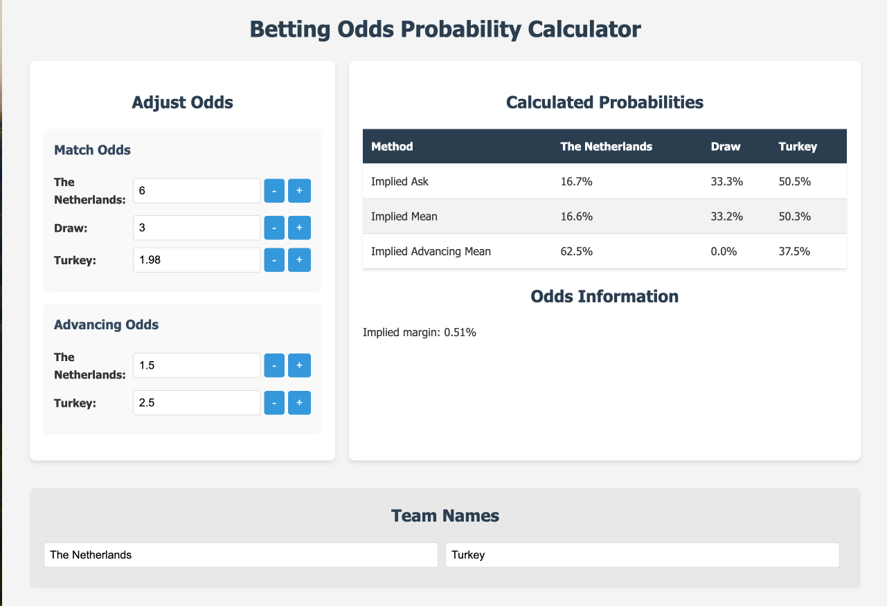

# Betting Odds Probability Calculator

Simple Flask-based web interface that can be used for football insights. Connects to multiple users via websockets with a global shared state, allowing for quick and efficient adjustments during a match. 

A Tampermonkey script is included ([unibet.js](./unibet.js)) that periodically fetches odds from an Unibet football match and pushes them to the Flask server. 
